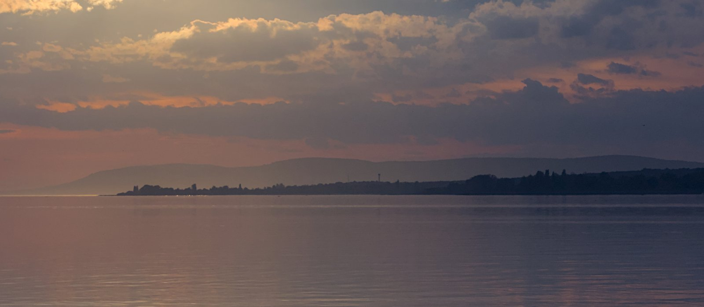

{fig-alt="A Balaton alkonyatkor"}

# Üdv a honlapomon!

Környezetmérnöki háttérű kutatóként édesvízi ökológiával, fitoplanktonnal és ökológiai modellezéssel foglalkozom.
Azzal a céllal hoztam létre ezt a honlapot, hogy a munkámhoz és szakmai érdeklődésemhez kapcsolódó posztokon keresztül
érthetőbbé tegyem a tudományos gondolkodás és az adatok szerepét korunk környezeti kihívásainak értelmezésében.

Érdemi tartalom hamarosan...
